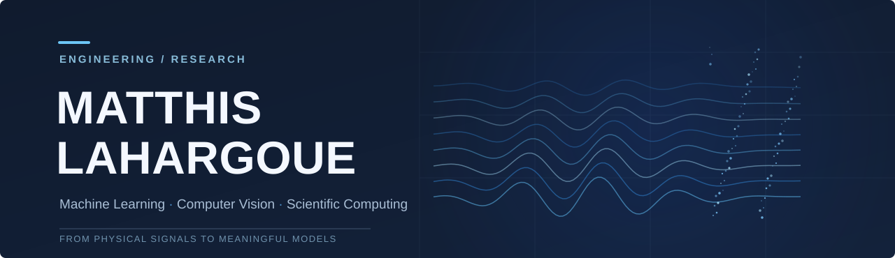
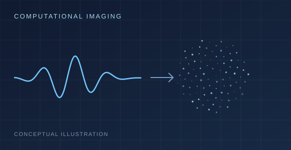
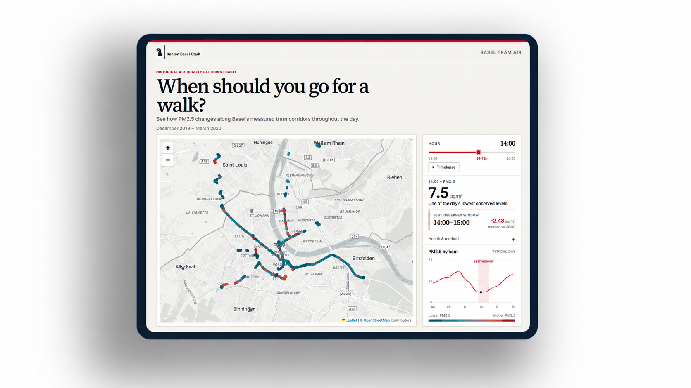

<!-- GitHub profile README · scientific minimalism / engineering portfolio -->
<!-- Project artwork is conceptual, not experimental data or a geographic map. -->

  

  <a href="#selected-work">Selected work</a>
  &nbsp;&nbsp;·&nbsp;&nbsp;
  <a href="#technical-focus">Technical focus</a>
  &nbsp;&nbsp;·&nbsp;&nbsp;
  <a href="https://github.com/matla91/basel-tram-air">Basel Tram Air</a>
  &nbsp;&nbsp;·&nbsp;&nbsp;
  <a href="https://www.linkedin.com/in/matthis-lahargoue/">LinkedIn</a>

 

### From physical signals to meaningful models.

I'm a **French engineering student** pursuing a double degree in Computer Science at **ENSISA** and **UQAC**, with a focus on artificial intelligence.

I'm currently a **research intern at the French-German Research Institute of Saint-Louis (ISL)**, working at the intersection of **machine learning, computational imaging, and scientific computing**. I enjoy building the full experimental pipeline: from simulation and data preparation to model training, quantitative evaluation, and visualization.

My interests extend to **computer vision, inverse problems, and research-oriented ML engineering**.

 

## Selected work

<table>
  <tr>
    <td width="50%" valign="top">
      
      <h3>Computational imaging · NLOS</h3>
      
Research on learning-based reconstruction beyond the line of sight, combining transient-light simulation, ML, and quantitative reconstruction analysis.

      
<code>PyTorch</code> <code>Mitsuba 3</code> <code>Dr.Jit</code> <code>CUDA</code>

      
Research work · Not a public repository

    </td>
    <td width="50%" valign="top">
      
      <h3>Basel Tram Air</h3>
      
A hackathon data project exploring PM2.5 air-quality patterns along Basel's tram corridors, with a focus on analysis and visual communication.

      
<code>Python</code> <code>Data analysis</code> <code>Visualization</code>

      
<a href="https://github.com/matla91/basel-tram-air">View repository →</a>

      
Hack am Rhein warm-up · 2026

    </td>
  </tr>
</table>

The Basel Tram Air visual is a real project screenshot; the computational imaging visual remains an original conceptual illustration.
 

## Technical focus

| Machine learning | Scientific computing | Engineering |
| :--- | :--- | :--- |
| Python · PyTorch | Mitsuba 3 · Dr.Jit | Linux · Git |
| Model training & evaluation | Simulation & inverse problems | CUDA · Reproducible pipelines |
| Computer vision | Computational imaging | Data processing & visualization |

 

## Currently exploring

Learning-based reconstruction, simulation-driven datasets, and reliable evaluation for scientific ML — while building toward a career in **machine learning and computer vision engineering**.

Open to connecting with researchers and engineers working on ML, vision, and scientific computing.

